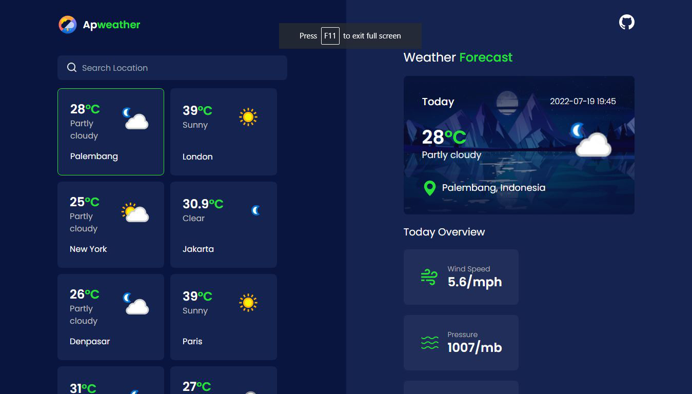

## Weather Forecasting | Apweather



this is a weather forecasting app that is used to predict the weather and temperature of each location in the world. this app was created using vanilla javascript (no framework), and also using CSS framework, namely tailwindcss to make it easy to styling

### Installation

1. Clone the repo
   ```sh
   git clone https://github.com/elvirafimansyah/Apweather.git
   ```
2. Running Locally